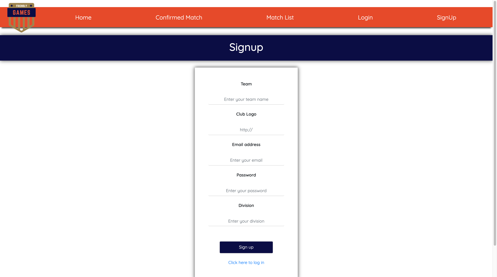
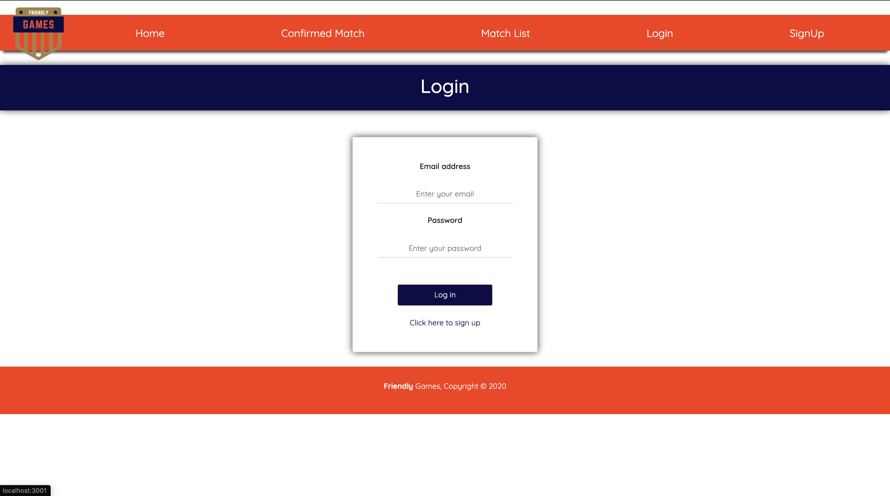
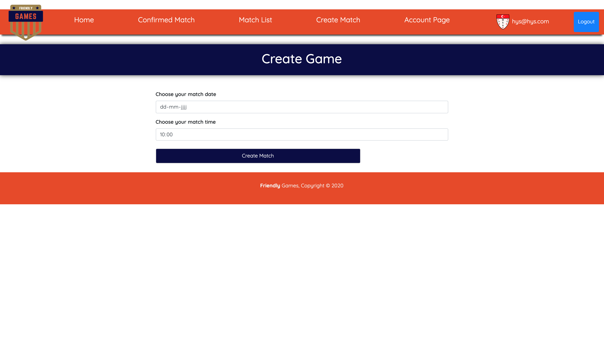

# Friendly Games

Friendly Games is an application that allows to create amateur soccer associations to reach each other for friendly Matches.

## Table of contents:

- **[App demo](#app-demo)**
- **[Goals for this project](#goals-for-this-project)**
- **[Technologies used](#technologies-used)**
- **[User stories](#user-stories)**
- **[Data Model](#data-model)**
- **[Server repo](#server-repo)**

### App demo:

### Instalation

1. Clone the app
2. cd into your project
3. install dependencies (npm install)
4. Start development server with (npm start)

### Server Repo

The server of this project is built with Express on Node.js connected to Postgres database.

[Click here to view server repo](https://github.com/chasin87/Friendly-Game-BE)
